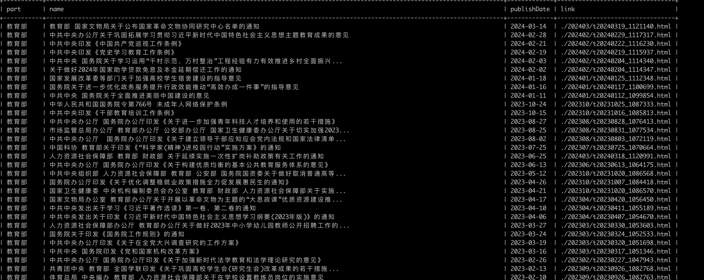

## 项目介绍
关注国内官方政府网站，获取政策动向，将获取的数据存储支数据库。



样例如上所示。

## 如何运行

通过 `scrapy crawl gov` 命令即可运行，如果需要保存成本地文件，可使用类似：

```
scrapy crawl gov -o gov.json
```

保存成不同格式，如果需要将数据保存至数据库，先创建表结构：

```
create database if not exists policy_db;
use policy_db;
create table if not exists policy(id int  AUTO_INCREMENT PRIMARY KEY, name varchar(256), link varchar(256), publishDate varchar(256), policyType varchar(256), reqeustURL varchar(256), created_at TIMESTAMP DEFAULT CURRENT_TIMESTAMP)
```

修改`settings.py`文件中的数据库连接信息。